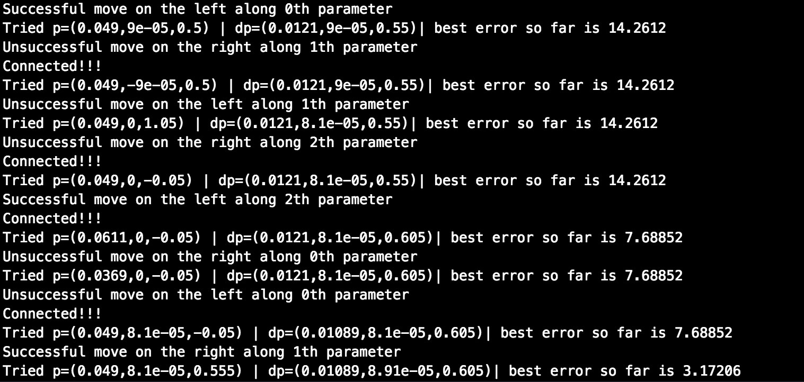

# CarND-Controls-PID

[](http://www.udacity.com/drive)

General instructions
---

[//]: # (Image References)

[image1]: ./images/simulator.png "Simulator"
[image2]: ./images/EKF_simulator.png "Simulator outputs"

In this project you'll revisit the lake race track from the Behavioral Cloning Project. This time, however, you'll implement a PID controller in C++ to maneuver the vehicle around the track!

The simulator will provide you the cross track error (CTE) and the velocity (mph) in order to compute the appropriate steering angle.

![alt text][image1]

Passing the project requires obtaining a car able to  successfully drive a lap around the track. No tire may leave the drivable portion of the track surface. The car may not pop up onto ledges or roll over any surfaces that would otherwise be considered unsafe (if humans were in the vehicle).

This project involves the Term 2 Simulator which can be downloaded [here](https://github.com/udacity/self-driving-car-sim/releases).


## Dependencies

* cmake >= 3.5
 * All OSes: [click here for installation instructions](https://cmake.org/install/)
* make >= 4.1(mac, linux), 3.81(Windows)
  * Linux: make is installed by default on most Linux distros
  * Mac: [install Xcode command line tools to get make](https://developer.apple.com/xcode/features/)
  * Windows: [Click here for installation instructions](http://gnuwin32.sourceforge.net/packages/make.htm)
* gcc/g++ >= 5.4
  * Linux: gcc / g++ is installed by default on most Linux distros
  * Mac: same deal as make - [install Xcode command line tools]((https://developer.apple.com/xcode/features/)
  * Windows: recommend using [MinGW](http://www.mingw.org/)
* [uWebSockets](https://github.com/uWebSockets/uWebSockets)
  * Run either `./install-mac.sh` or `./install-ubuntu.sh`.
  * If you install from source, checkout to commit `e94b6e1`, i.e.
    ```
    git clone https://github.com/uWebSockets/uWebSockets 
    cd uWebSockets
    git checkout e94b6e1
    ```
    Some function signatures have changed in v0.14.x. See [this PR](https://github.com/udacity/CarND-MPC-Project/pull/3) for more details.
* Simulator. You can download these from the [project intro page](https://github.com/udacity/self-driving-car-sim/releases) in the classroom.


## Basic Build Instructions

1. Clone this repo.
2. Make a build directory: `mkdir build && cd build`
3. Compile: `cmake .. && make`
4. Run it: `./pid`. 


## Accomplished work

The goal of this project is to implement a proportional–integral–derivative controller (PID controller) that uses the cross-track error (distance of the car to the road line) to controlle the steering angle of the car. The project was mainly composed of two steps, first implementing the PID controller in C++ and then tuning the hyperparameters. 


### Implementation of the PID in C++ 

The implementation of the PID class can be found in the   [PID.cpp](src/PID.cpp) file. It boils down to a function **Init** 

```cpp
void PID::Init(double Kp, double Ki, double Kd) {
  this->Kp = Kp;
  this->Ki = Ki;
  this->Kd = Kd;
  this->p_error = 0;
  this->count = 0;
  this->total_error = 0;
}
```

enabling the initialization of the gains of the PID controller, an update function **UpdateError** 

```cpp
void PID::UpdateError(double cte) {
  this->d_error = cte - this->p_error;
  this->i_error+= cte;
  this->total_error += cte*cte;
  this->p_error = cte;
  this->count +=1;
}
```

to keep track of necessary quantities (such as the current error, the derivative and a running sum of the previous error for the proporitional, derivative and integral terms in the PID controller) and of course a function **ComputeSteering**

```cpp
double PID::ComputeSteering(){
  return -Kp*p_error-Ki*i_error-Kd*d_error;
}
```
to compute the steering angle.

These two last functions are then used in the [main.cpp](src/main.cpp) file as follows 

```cpp
pid.UpdateError(cte);
steer_value = pid.ComputeSteering(); 
```
### Tuning of the hyperparameters 

Once the PID controller was running on the simulator, some tuning of the hyperparameters, namely the gains of the PID controller, was needed in order to obtain a car meeting the critera. 

To do so, I first manually tried to find a set of parameters for which the car was able to drive at least on a small portion of the road. With (Kp, Ki, Kd) = (5e-2,0,0) 


I was able to get the car moving, but the PID was clearly not good enough since the car was experiencing wild oscillations while turning which caused this kind of accident.


To avoid this kind of accident, I increased the derivative gain and tried (Kp, Ki, Kd) = (5e-2,0,1). Clearly, this solved the oscillations as expected  


but the car was not able to accomplish a full lap with these parameters. 

I therefore moved to a more systematic approach using the **twiddle algorithm**, also known as “coordinate ascent”, which is a brute force generic algorithm that tries to find a good choice of parameters in a smart way. The brute force part comes from the fact it is a kind of grid search algorithm where we try a bunch a different values. However, it is smart in the sense that it adapts the sizes of the grid as new values are tested. When tested values tend to yield poorer performance, the step size is decreased, while it is increased when tested values yield better performance. Here is an overview of the algorithm as implemented:


```
# Initialization
p = first guess
dp = step sizes
best_perf = best performance so far
# Twiddle algorithm
while ||dp|| > criteria:
	for each parameter pi in p:
		assess performance with pi+dpi and pi-dpi
		if performance > best_perf:
			update best_perf
			increase step size dpi
		else
			decrase step size dpi
```

Here the performance is assessed using the mean square of the cross-track error (the lower the better).

This algorithm is implemented in the [main.cpp](src/main.cpp) file between lines 86 and 174. Here is a sample output of the algorithm as it tries values.




### Final results

I let the twiddle run over night and I obtained the values (Kp, Ki, Kd) = (0.321658,4.89713e-05,5.30355). Here is how the car behaves with these values on the circuit.


The tuned values found by the twiddle algorithm are satisfactory in the sense that they yield a driving behavior that meets the criteria (the car never leaves the track). However, we can note that the car doesn't behave naturally in some turns. This is probably due to the fact that the speed is not taken into account in my approach. For example we could reduce the speed in the turns and increase the speed in straight lines. This could be implemented with some hard coded rules or we could try to implement a second PID controller on the speed itself.